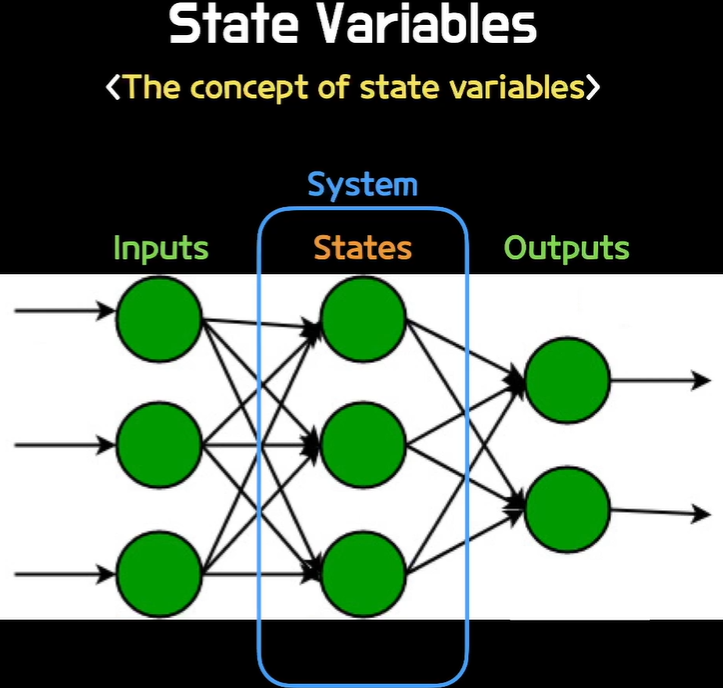
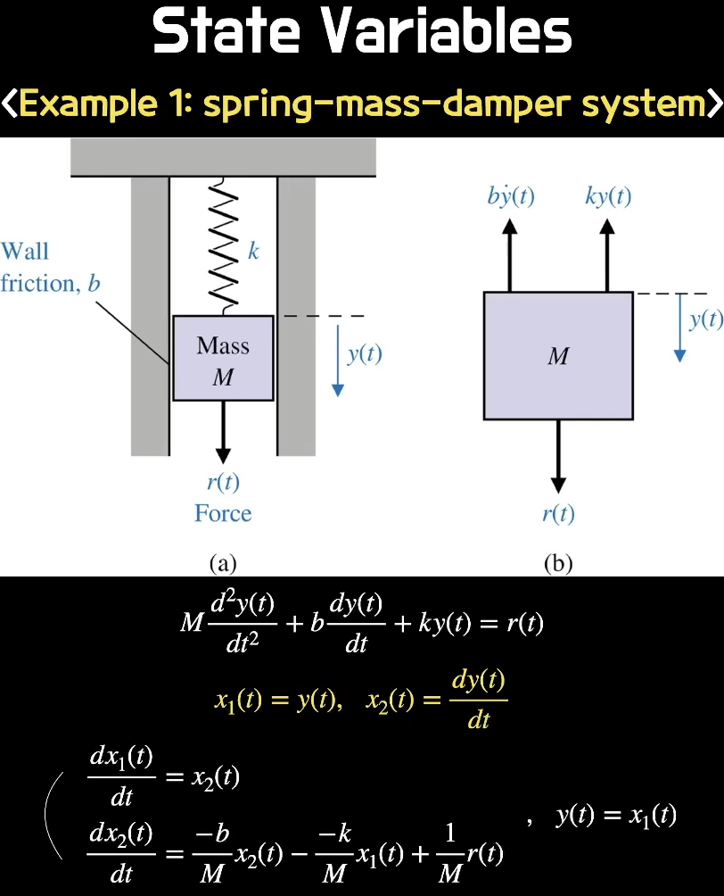
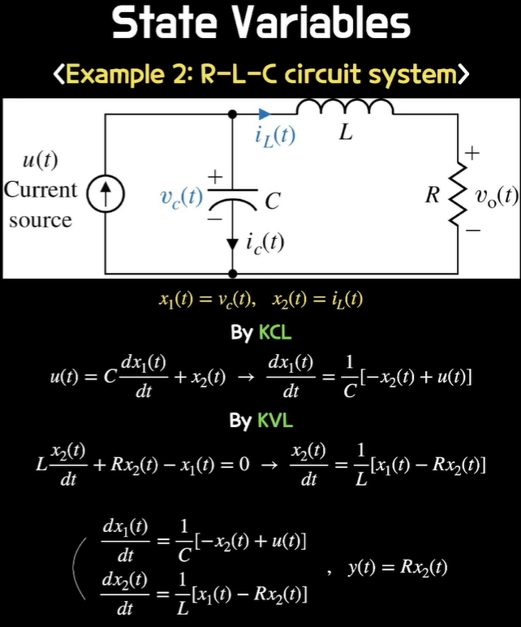

# 2023732036 강민주 제어공학1 5주차 과제

---

## State Variabels
### The concept of state variables
  
system을 수식화할 때 system 안에 의미가 있는 것들 또는 의미부여 하고자 하는 것들을 state로 정의하고 이 state를 중심으로 문제를 해결한다.  
- 문제를 푸는 과정에 의미부여
- 컴퓨터에게 일을 시키기 쉽게 하기 위함

### Ex 1: spring-mass-damper system
  
$$M \frac{d^2 y(t)}{dt^2} + b \frac{dy(t)}{dt} + k y(t) = r(t)$$  
위 식은 2차 미분방정식이므로 2개의 state를 설정해 1차 미분방정식 2개를 연립한다.  

### Ex 2: R-L-C circuit system
  
state를 설정 시 state끼리 무관해야 하며 항등식이 되면 안된다.  
독립적이어야 한다.  

## State Space Equation
### 1st order state differential equation
  
초기값 또는 Input이 $\Phi(t)$라는 함수에 의해 변환되어 $\x(t)$로 전달된다.  

