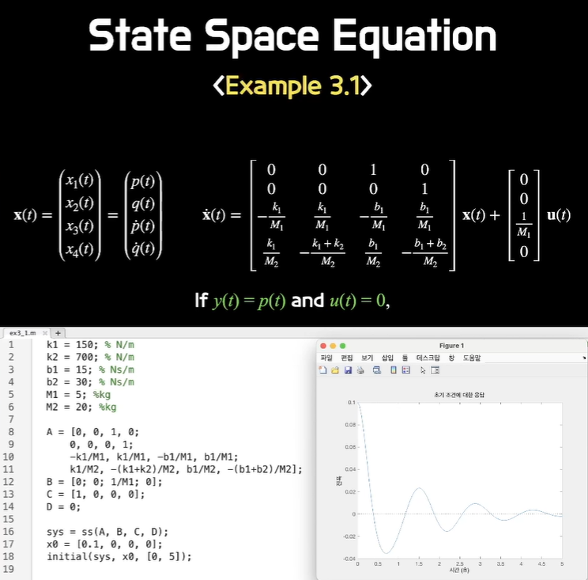

# 2023732036 강민주 제어공학1 5주차 과제

---

## State Variabels
### The concept of state variables
  
system을 수식화할 때 system 안에 의미가 있는 것들 또는 의미부여 하고자 하는 것들을 state로 정의하고 이 state를 중심으로 문제를 해결한다.  
-> 미분방정식을 얻고 그 안에 state를 정의해서 의미를 부여한다.  
state는 Input과 같은 state의 영향을 받는다.  
Output은 Input과 state의 관계로 나타낼 수 있다.  
  
state
- 문제를 푸는 과정에 의미부여
- 컴퓨터에게 일을 시키기 쉽게 하기 위함
  
### Ex 1: spring-mass-damper system
  
$$M \frac{d^2 y(t)}{dt^2} + b \frac{dy(t)}{dt} + k y(t) = r(t)$$  
위 식은 2차 미분방정식이므로 2개의 state를 설정해 1차 미분방정식 2개를 연립한다.  
  
### Ex 2: R-L-C circuit system
  
state를 설정 시 state끼리 무관해야 하며 항등식이 되면 안된다.  
독립적이어야 한다.  
  
---
  
## State Space Equation
### 1st order state differential equation
  
초기값 또는 Input이 $\Phi(t)$라는 함수에 의해 변환되어 $x(t)$로 전달된다.  
왼쪽은 초기 상태가 변환되어 나온 결과, 오른쪽은 Input에 의해 생긴 것을 변환하여 나온 결과이다.  
  
### State vector and state space equation
  
n차 미분방정식 사용 시 state 개수도 n개이다.  
state는 vector로 정의된다.  
State Differential Equation: 다차 미분방정식을 여러 개의 1차 미분방정식으로 바꿔서 행렬로 바꾼 것  
Output Equation: state들과 조합해서 Output을 만드는 것  
State Space Equation: State Differential Equation과 Output Equation을 합친 것  
  
### State transition matrix
  
다차 방정식의 경우 여러 개의 1차 미분방정식의 연립 미분 방정식이 된다.  
따라서 1차 행렬 미분방정식이 된다.  
이 1차 행렬 미분방정식을 가지고 라플라스 변환을 수행하고 $\Phi(s)$로 치환하면 행렬 기준으로 값을 얻을 수 있다.  
  
### Ex 3.1
  
2차 미분방정식 2개가 만들어진다.  
-> 4차 미분방정식  
4차 미분방정식은 풀기가 어렵기 때문에 state를 4개 정의해서 4개의 1차 미분방정식을 만든다.  
1차 미분방정식 4개 -> 연립방정식 -> 행렬 미분방정식  
  
  
ss: State Space Equation에 행렬 4개를 넣어주면 시스템으로 만들어주는 함수  
initial(sys, x0, [0, 5]): sys 시스템에서 초기값 x0를 넣고 0~5초 동안 실행
